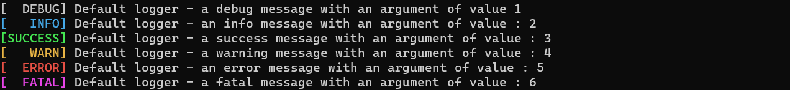
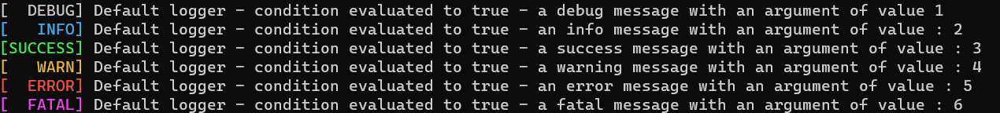
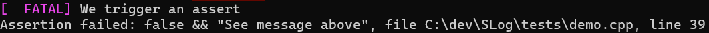
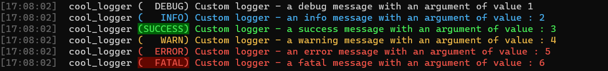

# SLog - A simple logging library


[](https://github.com/TBlauwe/slog/releases)
[](https://github.com/TBlauwe/slog/blob/master/LICENSE)
[](https://TBlauwe.github.io/slog/)
[](https://TBlauwe.github.io/slog/examples.html)

)
)
)


<div align="center">

Opinionated and simple logging library built around **[FMT](https://github.com/fmtlib/fmt)**.

</div>


## Features

* Static logger
* Multiple loggers with different configuration
  * Override members to customize your logger. See [Basic Usage](#Basic-Usage) below.
* Multi-colored output


## Getting started

### Installation

Require a __C++17__ compiler. Tested with (on windows 11) : 
* Clang-cl `15`
* MSVC `19.36`


Using **[CPM](https://github.com/cpm-cmake/)**, add the following lines to your cmake file:

```cmake
CPMAddPackage(
  NAME slog
  GITHUB_REPOSITORY TBlauwe/slog
)

target_link_libraries(your_target PUBLIC slog)
```

<details>
<summary> CMake options </summary>

| Options | Default | Description |
| ---: | :---: | :--- |
| `SLOG_DOWNLOAD_DEPENDENCIES` | `false` in consumer mode, `true` otherwise | Enable automatic dependencies downloading with **[CPM](https://github.com/cpm-cmake/)** |
| `CPM_MY_DEPENDENCY_VERSION` | `true` in consumer mode, `false` otherwise | Override a dependency's version. Value must be a git tag, e.g `master`, `v3.12`, `1.0` |

</details>


## Basic Usage


### Default logger


```cpp
slog::log::debug("my message with or without args {}", 13);
slog::log::info("my message with or without args {}", 14);
slog::log::success("my message with or without args {}", 15);
slog::log::warn("my message with or without args {}", 16);
slog::log::error("my message with or without args {}", 17);
slog::log::fatal("my message with or without args {}", 18);
```




### Macros

__SLog__ provides some macros to log (or assert) only if a condition is evaluated to true (or false).

```cpp
slog_debug_if(slog::log, true, "Default logger - condition evaluated to true - a debug message with an argument of value {}", 1);
slog_info_if(slog::log, true, "Default logger - condition evaluated to true - an info message with an argument of value : {}", 2);
slog_success_if(slog::log, true, "Default logger - condition evaluated to true - a success message with an argument of value : {}", 3);
slog_warn_if(slog::log, true, "Default logger - condition evaluated to true - a warning message with an argument of value : {}", 4);
slog_error_if(slog::log, true, "Default logger - condition evaluated to true - an error message with an argument of value : {}", 5);
slog_fatal_if(slog::log, true, "Default logger - condition evaluated to true - a fatal message with an argument of value : {}", 6);
```



```cpp
slog_assert(my_logger, false, "We trigger an assert", 13);
```




### Custom Logger


```cpp
// Define a logger by inheriting CRTP class slog::Logger
struct my_logger : public slog::Logger<my_logger>
{
	// Override / customize your parameters
	static constexpr const char * logger_name {"cool_logger"}; 
	static constexpr bool use_message_style {true}; 
	static constexpr bool show_fatal_bg {true}; 
	static constexpr bool show_success_bg {true}; 
	static constexpr fmt::rgb fatal_bg {99,7,0}; 
	static constexpr fmt::rgb fatal_fg {232,80,69}; 
};

my_logger::debug("Custom logger - a debug message with an argument of value {}", 1);
my_logger::info("Custom logger - an info message with an argument of value : {}", 2);
my_logger::success("Custom logger - a success message with an argument of value : {}", 3);
my_logger::warn("Custom logger - a warning message with an argument of value : {}", 4);
my_logger::error("Custom logger - an error message with an argument of value : {}", 5);
my_logger::fatal("Custom logger - a fatal message with an argument of value : {}", 6);
```




## Description

Thanks to **[CRTP](https://en.wikipedia.org/wiki/Curiously_recurring_template_pattern)**, loggers
are static struct configured with only static members. 

Speed is not the main concern as it is designed to be removed from build release.
Still, it use fmt::memory_buffer to construct the string. Meaning there is only one print
per call. Thread-safety as not been checked for now.

Some defines :
* `NO_SLOG_LOG` : if defined, function calls are empty, macros are set to ((void)0)
* `NO_SLOG_ASSERT` : if defined, assert macro is set to `((void)0)`


## Dependencies

 * **[FMT](https://github.com/fmtlib/fmt)**, tested with version `10.0.0`

If building as main project, dependencies are automaticaly downloaded with **[CPM](https://github.com/cpm-cmake/)**.
This step can be skipped by setting `SLOG_DOWNLOAD_DEPENDENCIES` to `ON`. 

Setting `CPM_FMT_VERSION` will override the downloaded version (`10.0.0` by default).


## Configuration

First, let's assume you have the following logger : 

```cpp
struct my_logger : public slog::Logger<my_logger>
{
	// We will add configuration parameters by adding static constexpr member
};
```

There is four parameters category :
* __Time__ : parameters related to time display
* __Logger__ : parameters related to logger name display
* __Level__ : parameters related to log's level display
* __Message__ : parameters related to message display

Here are the available parameters for each category (with default values):

### Time

```cpp
static constexpr bool show_time {true};
```

Whether or not time should be displayed or not.

```cpp
static constexpr bool show_time_bg {false};
```

Whether or not a colored background for time should be displayed or not.

```cpp
static constexpr fmt::rgb time_bg {20,20,20};
```

Time's background color (rgb).

```cpp
static constexpr fmt::rgb time_fg {100,100,100};
```

Time's foreground (text) color (rgb).

```cpp
static constexpr const char * time_format {"[{:%H:%M:%S}]"};
```

Time's format. See format specifications [here](https://fmt.dev/latest/syntax.html#chrono-specs)


### Logger
```cpp
static constexpr bool show_logger_name {true};
```

Whether or not logger's name should be displayed or not.

```cpp
static constexpr const char * logger_name {"default"};
```

Name to display

```cpp
static constexpr bool show_logger_bg {false};
```

Whether or not a colored background for logger name should be displayed or not.

```cpp
static constexpr fmt::rgb logger_bg {20,20,20};
```

Logger's background color (rgb).

```cpp
static constexpr fmt::rgb Logger_fg {200,200,200};
```

Logger's foreground (text) color (rgb).

```cpp
static constexpr const char * logger_format {"[{:%H:%M:%S}]"};
```

Logger's format. See format specifications [here](https://fmt.dev/latest/syntax.html#format-specification-mini-language)


### Level

Level's paramaters are divided into two groups, global parameters and level-specific
#### Global

```cpp
static constexpr bool show_level {true};
```

Whether or not level's name should be displayed or not.

```cpp
static constexpr const char* level_format {"({:>7})"};
```

Level's format. See format specifications [here](https://fmt.dev/latest/syntax.html#format-specification-mini-language)

#### Specific
Replace `<level>` by corresponding level's, e.g for debug, `<prefix>_fg` -> `degub_fg`.

```cpp
static constexpr bool show_<prefix>_bg {false};
```

Whether or not a colored background for level's name should be displayed or not.

```cpp
static constexpr fmt::rgb <prefix>_bg {20,20,20};
```

Level's background color (rgb).

```cpp
static constexpr fmt::rgb <prefix>_fg {200,200,200};
```

Level's foreground (text) color (rgb).


### Message

```cpp
static constexpr bool add_new_line {true};
```

Whether or not a new line should added at the end or not.

```cpp
static constexpr bool use_message_style {true}; 
```

Whether or not we override the message style, with or options or the default coloring provided by the string.
For example, if you want to log a string that is already colored, setting `use_message_style` to `true` will override
the color by the style infered from our others options.
In short :
* If set to `false`, no coloring but the one already present in the string.
* If set to `true`, maybe some coloring infered by SLog, but not by the string itself.

```cpp
static constexpr fmt::text_style message_style {};
```

Message's style. It is advised to set only emphasis, are foreground and background color
will most likely be overriden.

```cpp
static constexpr bool inherit_level_style {false};
```

Whether or not message's style should be exactly like current level's style.

```cpp
static constexpr bool propagate_level_fg {true};
```

If `inherit_level_style` is `false`, dictates whether or not message's foreground
should be exactly the same as level's one.

```cpp
static constexpr bool propagate_level_bg {false};
```

If `inherit_level_style` is `false`, dictates whether or not message's background 
should be exactly the same as level's one.


## Benchmarks

The library used for benchmarking is [Google benchmark](https://github.com/google/benchmark).

### Results

With following code : 

```
static void BM_string_info_no_arg(benchmark::State& state) {
	for (auto _ : state)
	{
		benchmark::DoNotOptimize(my_logger::to_string<slog::Level::Info>("message"));
	}
}

static void BM_string_info_with_1_arg(benchmark::State& state) {
	for (auto _ : state)
	{
		benchmark::DoNotOptimize(my_logger::to_string<slog::Level::Info>("message with arg {}", 1));
	}
}
```

We obtained the following results in release mode:

```
2023-07-30T11:46:39+02:00
Running C:\Users\33632\Source\Repos\TBlauwe\SLog\out\build\x64-release-clang\bin\Benchmarks.exe
Run on (16 X 3294 MHz CPU s)
CPU Caches:
  L1 Data 32 KiB (x8)
  L1 Instruction 32 KiB (x8)
  L2 Unified 512 KiB (x8)
  L3 Unified 16384 KiB (x1)
--------------------------------------------------------------------
Benchmark                          Time             CPU   Iterations
--------------------------------------------------------------------
BM_string_info_no_arg            558 ns          519 ns      1445161
BM_string_info_with_1_arg        579 ns          516 ns      1000000
```


## Credits

* **[FMT](https://github.com/fmtlib/fmt)**
* **[Doctest](https://github.com/doctest/doctest)**
* **[Google Benchmark](https://github.com/google/benchmark)**
