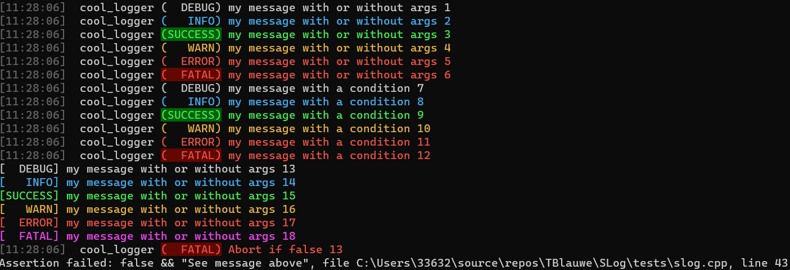

# Cpp library starter project

Opitionated and simple logging library I use across my project, 
that is easily customizable. It is built around **[FMT](https://github.com/fmtlib/fmt)**.

## Usage

```cpp
// Define a logger by inheriting CRTP class slog::Logger
struct my_logger : public slog::Logger<my_logger>
{
	// Override / customize your parameters
	static constexpr const char * logger_name {"cool_logger"}; 
	static constexpr bool show_fatal_bg {true}; 
	static constexpr bool show_success_bg {true}; 
	static constexpr fmt::rgb fatal_bg {99,7,0}; 
	static constexpr fmt::rgb fatal_fg {232,80,69}; 
};

// Now anywhere in code
my_logger::debug("my message with or without args {}", 1);
my_logger::info("my message with or without args {}", 2);
my_logger::success("my message with or without args {}", 3);
my_logger::warn("my message with or without args {}", 4);
my_logger::error("my message with or without args {}", 5);
my_logger::fatal("my message with or without args {}", 6);


// SLog also provides some macros to log only if a condition is verified :
slog_debug_if(my_logger, true, "my message with a condition {}", 7);
slog_info_if(my_logger, true, "my message with a condition {}", 8);
slog_success_if(my_logger, true, "my message with a condition {}", 9);
slog_warn_if(my_logger, true, "my message with a condition {}", 10);
slog_error_if(my_logger, true, "my message with a condition {}", 11);
slog_fatal_if(my_logger, true, "my message with a condition {}", 12);

// a default logger is also provided
slog::log::debug("my message with or without args {}", 13);
slog::log::info("my message with or without args {}", 14);
slog::log::success("my message with or without args {}", 15);
slog::log::warn("my message with or without args {}", 16);
slog::log::error("my message with or without args {}", 17);
slog::log::fatal("my message with or without args {}", 18);

// An assert is also provided, that abort if condition is false
slog_assert(my_logger, false, "Abort if false {}", 13);
```

Here what it looks like on the terminal :



## Features

* Quick integration and removal.
* Static logger configuratable through static members, without singleton pattern.
* Multiple loggers with different configuration.
* Colored output

## Integration

Using **[CPM](https://github.com/cpm-cmake/)** :
```
CPMAddPackage(
	NAME slog
	GITHUB_REPOSITORY tblauwe/slog
	GIT_TAG master
)

target_link_libraries(your_target PUBLIC slog)
```

## Description

Thanks to **[CRTP](https://en.wikipedia.org/wiki/Curiously_recurring_template_pattern)**, loggers
are static struct configured with only static members. 

Speed is not the main concern as it is designed to be removed from build release.
Still, it use fmt::memory_buffer to construct the string. Meaning there is only one print
per call. Thread-safety as not been checked for now.

Some defines :
* `NO_SLOG_LOG` : if defined, function calls are empty, macros are set to ((void)0)
* `NO_SLOG_ASSERT` : if defined, assert macro is set to ((void)0)
* `SLOG_TRACY_ZONE` : if defined, tracy zones are added; (TODO)


## Dependencies

 * **[FMT](https://github.com/fmtlib/fmt)**, tested with version `10.0.0`

If building as main project, dependencies are automaticaly downloaded with **[CPM](https://github.com/cpm-cmake/)**.
This step can be skipped by setting `MY_LIB_SKIP_DEPENDENCIES` to `ON`. By default, it is `OFF` if it is the main
project, `ON` otherwise.

Setting `CPM_FMT_VERSION` will override the downloaded version (`10.0.0` by default).

## Configuration

First, let's assume you have the following logger : 

```cpp
struct my_logger : public slog::Logger<my_logger>
{
	// We will add configuration parameters by adding static constexpr member
};
```

There is four parameters category :
* __Time__ : parameters related to time display
* __Logger__ : parameters related to logger name display
* __Level__ : parameters related to log's level display
* __Message__ : parameters related to message display

Here are the available parameters for each category (with default values):

### Time

```cpp
static constexpr bool show_time {true};
```
Whether or not time should be displayed or not.

```cpp
static constexpr bool show_time_bg {false};
```
Whether or not a colored background for time should be displayed or not.

```cpp
static constexpr fmt::rgb time_bg {20,20,20};
```
Time's background color (rgb).

```cpp
static constexpr fmt::rgb time_fg {100,100,100};
```
Time's foreground (text) color (rgb).

```cpp
static constexpr const char * time_format {"[{:%H:%M:%S}]"};
```
Time's format. See format specifications [here](https://fmt.dev/latest/syntax.html#chrono-specs)


### Logger
```cpp
static constexpr bool show_logger_name {true};
```
Whether or not logger's name should be displayed or not.

```cpp
static constexpr const char * logger_name {"default"};
```
Name to display

```cpp
static constexpr bool show_logger_bg {false};
```
Whether or not a colored background for logger name should be displayed or not.

```cpp
static constexpr fmt::rgb logger_bg {20,20,20};
```
Logger's background color (rgb).

```cpp
static constexpr fmt::rgb Logger_fg {200,200,200};
```
Logger's foreground (text) color (rgb).

```cpp
static constexpr const char * logger_format {"[{:%H:%M:%S}]"};
```
Logger's format. See format specifications [here](https://fmt.dev/latest/syntax.html#format-specification-mini-language)


### Level

Level's paramaters are divided into two groups, global parameters and level-specific
#### Global

```cpp
static constexpr bool show_level {true};
```
Whether or not level's name should be displayed or not.

```cpp
static constexpr const char* level_format {"({:>7})"};
```
Level's format. See format specifications [here](https://fmt.dev/latest/syntax.html#format-specification-mini-language)

#### Specific
Replace `<level>` by corresponding level's, e.g for debug, `<prefix>_fg` -> `degub_fg`.

```cpp
static constexpr bool show_<prefix>_bg {false};
```
Whether or not a colored background for level's name should be displayed or not.

```cpp
static constexpr fmt::rgb <prefix>_bg {20,20,20};
```
Level's background color (rgb).

```cpp
static constexpr fmt::rgb <prefix>_fg {200,200,200};
```
Level's foreground (text) color (rgb).


### Message

```cpp
static constexpr bool add_new_line {true};
```
Whether or not a new line should added at the end or not.

```cpp
static constexpr fmt::text_style message_style {};
```
Message's style. It is advised to set only emphasis, are foreground and background color
will most likely be overriden.

```cpp
static constexpr bool inherit_level_style {false};
```
Whether or not message's style should be exactly like current level's style.

```cpp
static constexpr bool propagate_level_fg {true};
```
If `inherit_level_style` is `false`, dictates whether or not message's foreground
should be exactly the same as level's one.

```cpp
static constexpr bool propagate_level_bg {false};
```
If `inherit_level_style` is `false`, dictates whether or not message's background 
should be exactly the same as level's one.


## Additional targets

Tests, docs and benchmarks adds additional targets. It was choosen to not propose option to build them, as they will
be built only if this is the main project.

## Documentation

Two targets are provided :

* `BuildDocs` uses **[m.css](https://mcss.mosra.cz/)** from **[Magnum Engine](https://magnum.graphics/)** to build the documentation.
* `OpenDocs` is a convenience target to open docs without the hassle of finding it.

The following tools are needed :
* Doxygen, 
* jinja2 
* Pygments 

### Instructions

On MacOs :
```
brew install doxygen
pip3 install jinja2 Pygments
```

On windows using chocolatey (need elevated privileges) :
```
choco install doxygen.install
choco install python
pip3 install jinja2 Pygments
```

> Make sure to add doxygen to your path !

## Tests

The library used for testing is [Doctest](https://github.com/doctest/doctest).


## Benchmarks

The library used for benchmarking is [Google benchmark](https://github.com/google/benchmark).

### Results

With following code : 

```
static void BM_string_info_no_arg(benchmark::State& state) {
	for (auto _ : state)
	{
		benchmark::DoNotOptimize(my_logger::to_string<slog::Level::Info>("message"));
	}
}

static void BM_string_info_with_1_arg(benchmark::State& state) {
	for (auto _ : state)
	{
		benchmark::DoNotOptimize(my_logger::to_string<slog::Level::Info>("message with arg {}", 1));
	}
}
```

We obtained the following results in release mode:

```
2023-07-30T11:46:39+02:00
Running C:\Users\33632\Source\Repos\TBlauwe\SLog\out\build\x64-release-clang\bin\Benchmarks.exe
Run on (16 X 3294 MHz CPU s)
CPU Caches:
  L1 Data 32 KiB (x8)
  L1 Instruction 32 KiB (x8)
  L2 Unified 512 KiB (x8)
  L3 Unified 16384 KiB (x1)
--------------------------------------------------------------------
Benchmark                          Time             CPU   Iterations
--------------------------------------------------------------------
BM_string_info_no_arg            558 ns          519 ns      1445161
BM_string_info_with_1_arg        579 ns          516 ns      1000000
```


### Configurations

If you want to pass more options to tune the benchmarking, see 
[Google benchmark usage guide](https://github.com/google/benchmark/blob/main/docs/user_guide.md).

Alternitavely, you can use `bin\benchmarks\run_benchmarks.py` python script, to run benchmarks with a predefined set of options.

```
py run_benchmarks.py Benchmarks.exe -n SomeName
```

This line will generate a `.json` file with 'SomeName' in its name. It will also repeat benchmarks 10 times and compute the mean, median, variance, etc.

To compare two benchmarks, you can use the following command :

```
py tools/compare.py benchmarks <baseline> <comparison>
```

Replace `<baseline>` and `<comparison>` with `.json` files obtained when running your benchmarks.

## Credits

* **[FMT](https://github.com/fmtlib/fmt)**
* **[Doctest](https://github.com/doctest/doctest)**
* **[m.css](https://mcss.mosra.cz/)** from **[Magnum Engine](https://magnum.graphics/)**
* **[Google Benchmark](https://github.com/google/benchmark)**
